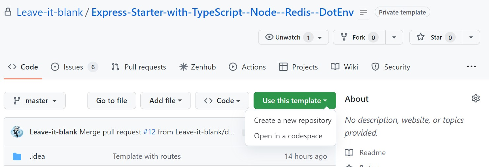

# Express API Starter

[](https://opensource.org/licenses/Apache-2.0)

How to use this template:

    

Includes API Server utilities:

- [Prisma](https://www.npmjs.com/package/prisma)
  - ORM for Mysql schema generation and manupulation
- [Cron](https://www.npmjs.com/package/node-cron)
  - For Sheduling the jobs to run.
- [Redis](https://www.npmjs.com/package/redis)
  - Caching solution for jwt refresh token
- [Mysql](https://www.npmjs.com/package/morgan)
  - Database for storing data.
- [morgan](https://www.npmjs.com/package/morgan)
  - HTTP request logger middleware for node.js
- [helmet](https://www.npmjs.com/package/helmet)
  - Helmet helps you secure your Express apps by setting various HTTP headers. It's not a silver bullet, but it can help!
- [dotenv](https://www.npmjs.com/package/dotenv)
  - Dotenv is a zero-dependency module that loads environment variables from a `.env` file into `process.env`
- [cors](https://www.npmjs.com/package/cors)
  - CORS is a node.js package for providing a Connect/Express middleware that can be used to enable CORS with various options.

Development utilities:

- [nodemon](https://www.npmjs.com/package/nodemon)
  - nodemon is a tool that helps develop node.js based applications by automatically restarting the node application when file changes in the directory are detected.
- [eslint](https://www.npmjs.com/package/eslint)
  - ESLint is a tool for identifying and reporting on patterns found in ECMAScript/JavaScript code.
- [Typescript](https://www.npmjs.com/package/typescript)
  - For Tightly typing the codebase.

## Work in progress

- [Docker](https://www.npmjs.com/package/docker)
  - Dockerize the whole application
- [jest](https://www.npmjs.com/package/jest)
  - Jest is a delightful JavaScript Testing Framework with a focus on simplicity.
- [supertest](https://www.npmjs.com/package/supertest)
  - HTTP assertions made easy via superagent.

## Setup

```
npm install
```

## Test (wip)

```
npm test
```

## Development

```
npm run dev
```

## Project layout

The code for the microservice is contained in the `source` directory. All of the test are in the `tests` folder(wip). The code follows the **Model-View-Controller** pattern with all of the database code and business logic in the controler dir, and all of the RESTful routing (`routes`) Dir which supports sub folder routing.

```text
├── documentation       <- template documentation files
├── source              <- microservice template
│   ├── controllers/    <- application controllers for routes <- microservice
│   ├── server.ts       <- express configuration file
│   ├── tests/          <- code for the testing various apis  //wip
│   └── routes/         <- code for the REST API routes
├── tsconfig.json       <- ts setup config
├── package.json        <- node setup config
├── .env.example        <- example setup env file
└── prisma                       <- prima ORM
    ├── schema.prisma            <- mysql schema
    └── migration/               <- migration schema
```

## Data Model

The User model contains the following fields:

| Name       | Type       | Optional |
| ---------- | ---------- | -------- |
| id         | Integer    | False    |
| username   | String(64) | False    |
| email      | String(64) | False    |
| password   | String(32) | False    |
| api_key    | String(32) | False    |
| role       | enum(role) | False    |
| created_at | DateTime   | auto     |
| updated_at | DateTime   | auto     |
| deleted_at | DateTime   | auto     |

Role Enum
| Name | Optional |
| ---------- | -------- |
| USER | default |
| ADMIN | False |
| MANAGER | False |

## Author

[Leave it Blank](https://github.com/Leave-it-blank/)

## License

Licensed under the Apache License. See [LICENSE](LICENSE)
